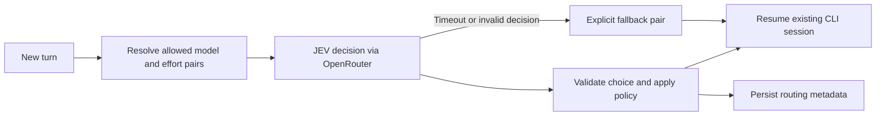

# Experimental chat features and JEV smart routing

Proposal, 27 September 2026. Based on `main` at `5dd03e9`.

Implementation status: the Codex experiment is now implemented, with automated
backend and browser tests. Claude Code routing remains deferred. See the
[README](../../README.md) for current behavior and setup. Live-provider validation,
routing-quality evaluation, and recommendation-only evaluation mode remain future
work; the sections below preserve the broader original proposal.

The proposed first experiment selects a model and reasoning effort before each new
chat turn. Codex chats stay on OpenAI models and Claude Code chats stay on Anthropic
models. JEV supplies the decision; the existing authenticated CLI executes the task.

**Required billing boundary:** all coding/chat generation uses the user's existing
Codex or Claude Code subscription through the official CLI. Only JEV's small routing
decision uses the separately billed OpenRouter API. Do not send the actual agent task
to an OpenRouter completion model, replace CLI authentication with an API key, or
fall back to paid model APIs when a subscription reaches a limit. Subscription access
and limits continue to apply to every chosen model.

## What the research establishes

Jev is TypeSafe's structured decision model, described as a System One model. It
accepts text or structured textual state and returns typed decisions. It does not
write the answer, generate code, or explain its reasoning. Its primitives are Choice
(one option), Noul (a yes/no probability), and Score (an ordered scale).
[TypeSafe concepts](https://docs.typesafe.ai/concepts/system-one)

OpenRouter exposes `typesafe/jev-1.13` through
`POST https://openrouter.ai/api/alpha/decisions`. The request contains `state` and
`questions`; a Choice response includes the selected option, probabilities, and
confidence. Responses also identify the served model and report usage/cost. Pin the
versioned model for this experiment and record the returned version, rather than
silently following the latest alias.
[OpenRouter Decisions reference](https://openrouter.ai/docs/api/api-reference/alphadecisions/submit-a-decisions-request)

OpenRouter currently lists 32,000 tokens of context, $0.042 per million input tokens,
and free output tokens. At that rate, a routing request with 4,000 total input tokens
costs approximately $0.000168, or $0.168 per 1,000 decisions. These are calculations
from listed prices, excluding the agent run. Measure actual `usage.cost` and network
latency; no end-to-end latency or savings claim has been verified here.
[Jev pricing](https://openrouter.ai/typesafe/jev-1.13)

There is also a separate `typesafe/jev-router`, released September 25, which advertises
automatic model and effort selection through OpenRouter's completion API. The
documentation reviewed does not establish a decision-only interface with the precise
same-family, CLI-compatible candidate restrictions required here. Using its completion
endpoint would move execution onto OpenRouter instead of the app's subscription CLI.
Use the base decision model for this proposal. Do not interpret the router's displayed
zero price as verified free downstream model execution.
[Jev Router](https://openrouter.ai/typesafe/jev-router)

Confidence measures the concentration of the returned probability distribution. It
is not a measured probability that a coding task will succeed. Similar model choices
may divide the probability mass even when either would work. Calibrate thresholds
against our tasks and candidate sets; the provider recommends domain-specific testing.
[TypeSafe confidence](https://docs.typesafe.ai/confidence)

## Product behavior

Add **Impostazioni → Sperimentali**, reachable from every existing settings tab.
It contains a master experimental-features switch, initially off, and a list of
experiments. The first entry is **Routing intelligente · JEV**, with its own availability
switch and an OpenRouter connection status. Enabling availability does not activate
routing in every chat.

In **Nuova chat**, immediately below the existing MCP/skills picker, show
**Funzionalità sperimentali** with a checkbox for each globally available, compatible
experiment. JEV starts unchecked. Its expanded configuration includes:

- Available models for the selected agent, with individual inclusion checkboxes.
- Allowed reasoning efforts for each model, restricted to that model's capabilities.
- Preference: balanced by default, with speed and quality alternatives.
- An explicit fallback model/effort pair, initially the user's chosen normal pair.

Switching the agent in the creation dialog resets incompatible candidates. Existing
chats get the same experiment controls in chat settings. A manual model selection
switches that chat back to manual mode; routing never silently overrides that action.

Use **all visible models in the installed CLI catalog**, not a static list of all models
sold through OpenRouter. The local Codex cache inspected for this proposal lists
GPT-6 Astra, Sol, and Luna; GPT-5.6 Sol, Terra, and Luna; and GPT-5.5. This verifies
catalog presence on this host, not entitlement or successful execution on the deployed
server. Display catalog freshness and availability uncertainty where appropriate.

“Same family” means the same model vendor within the selected agent: Codex/OpenAI
or Claude Code/Anthropic. It permits switching between GPT generations. Hide internal
models and exclude candidates with unknown compatibility from automatic routing.
Newly discovered models appear in the list but require inclusion before routing to them.

During a run show **JEV → GPT-6 Sol · high**. Preserve that annotation with the response,
so older messages retain their actual requested model/effort. Distinguish requested
settings from provider-confirmed settings when the CLI reports them. Show a short
fallback notice when routing is unavailable. Do not invent a prose explanation from
JEV; it does not return one.

Effective enablement is the conjunction of the master switch, experiment availability,
chat opt-in, and usable configuration. Global disablement immediately prevents new
routing decisions, including queued work when it starts. Recheck it after an in-flight
decision and before spawning the CLI. An already executing agent finishes with its
existing settings. Preserve chat preferences while disabled; explicitly turning the
global switch back on restores those opted-in chats.

## How routing works

1. Wait until the queued message actually starts, after voice transcription when
   needed. Build a bounded routing state from the current request, recent completed
   messages, previous route, attachment types, tool availability, and recent outcome.
   Exclude later queued messages. The current `execute()` path omits app history when
   a CLI session exists, so routing needs its own bounded history query.
2. Construct valid model/effort pairs from the same-agent catalog and chat selection.
   Apply modality and context constraints before asking JEV. A smaller model must be
   able to resume the session context, not merely fit the small routing request; if
   that compatibility cannot be established, retain a known-compatible model. Missing
   catalog metadata must not produce guessed efforts or guessed model identifiers.
3. Send one Choice question over those pairs, plus a `keep_current` option when
   applicable. For example, `route_1` maps server-side to GPT-6 Luna/low and `route_2`
   to GPT-6 Sol/high. Criteria describe task suitability, capability, relative resource
   demand, and continuity. Maintain these descriptions as versioned policy inputs;
   JEV cannot discover current subscription limits or prove model quality from names.
4. Validate the selected ID against the exact submitted candidates. Apply the
   confidence policy, explicit fallback, and model-switching rules. Prefer continuity
   for follow-ups; require stronger evidence for a downgrade than an upgrade. A
   bounded request timeout, initially 2 seconds, is an engineering starting point to
   tune from measurements. Cancellation aborts the routing request and prevents spawn.
5. Pass the selected pair as a run-local override to the existing runner, preserving
   the CLI session and chat's saved manual fallback. Route once per user turn, not
   between tool calls within a running agent process.

A single Choice over valid pairs prevents independently chosen model and effort values
from conflicting. TypeSafe documents up to 255 options per Choice; if the candidate
space ever exceeds that, use staged selection with validation rather than silently
dropping user-selected models.
[Choice primitive](https://docs.typesafe.ai/primitives/choice)

Illustrative starting policy, to be evaluated rather than treated as benchmark results:

| Request                                        | Candidate behavior                |
| ---------------------------------------------- | --------------------------------- |
| Small explanation or straightforward edit      | Luna at low/medium effort         |
| Normal implementation with tests               | Sol at medium/high effort         |
| Difficult debugging or architectural reasoning | Astra at high/xhigh effort        |
| Brief continuation of a complex task           | Retain the previous capable model |
| Ambiguous context, timeout, malformed output   | Use the explicit fallback pair    |

GPT-5.6 variants remain selectable candidates. Do not rank them purely by generation.
Expose every supported effort, but require explicit inclusion for `max`/`ultra` in
automatic routing. The inspected local catalog describes `ultra` as including
automatic delegation, so it should not become an accidental consequence of enabling
the feature.

JEV's text-only input cannot assess the contents of screenshots. For image-dependent
requests, use a known vision-capable fallback unless sufficient textual context exists.
Bound the routing payload, initially around 4,000–6,000 tokens including criteria. Use
recent messages and deterministic truncation first; adding a paid summarizer would
introduce another latency and quality dependency.

On router failure, proceed with the saved explicit fallback. Freeze a concrete fallback
when enabling the experiment: a null “CLI/session default” could otherwise inherit the
last automatically selected model after routing is disabled. If no usable fallback can
be established, show the configuration problem instead of guessing. A provider error
after the agent starts does not justify replaying the turn: it may have performed work.

## Fit with the current code

| Area                                                                   | Proposed change                                                                                                                                                |
| ---------------------------------------------------------------------- | -------------------------------------------------------------------------------------------------------------------------------------------------------------- |
| `src/main.tsx`, settings components                                    | Add the experimental tab and shared tab navigation so it is reachable from Voice, MCP, Skills, and Terminal. Add the new-chat section after `ChatToolsPicker`. |
| New `src/ExperimentalSettings.tsx` and `src/ChatExperimentsPicker.tsx` | Global availability, connection status, per-chat opt-in, model pool, and effort configuration. Keep interface text Italian.                                    |
| `src/ModelPicker.tsx`, response/activity rendering                     | Manual/automatic state, fallback editing, and persisted per-run model/effort annotations.                                                                      |
| `server/agent-models.ts`                                               | Preserve descriptions, supported efforts, modality/context metadata, and catalog freshness; offer an agent-level catalog endpoint before a chat exists.        |
| `server/agent-effort.ts`                                               | Keep known effort vocabulary but validate automatic choices per model. The current agent-wide arrays alone are insufficient.                                   |
| New `server/experiments.ts` and `server/smart-routing.ts`              | Feature registry, validated configuration, bounded OpenRouter client, candidate policy, and fallback behavior.                                                 |
| `server/app.ts`                                                        | Authenticated settings/chat APIs; invoke routing before `runAgent`, within existing concurrency and cancellation handling.                                     |
| `server/store.ts`                                                      | Global configuration in existing settings; additive per-chat experiment configuration and per-run routing metadata with migrations.                            |
| `server/runner.ts`, `server/protocol.ts`                               | Explicit run-local selection; preserve resume and environment filtering; capture actual model/usage when available.                                            |

The runner already passes `--model` and `model_reasoning_effort` to Codex, including
`exec resume`; Claude uses `--model` and `--effort`. The installed Codex CLI's
`exec resume --help` confirms model and configuration overrides. Official documentation
also describes resuming non-interactive tasks. This supports the design, but a real
two-turn model-switch experiment is still needed before claiming provider compatibility.
[OpenAI CLI reference](https://developers.openai.com/codex/cli/reference)

Forks should copy experiment preferences and the explicit fallback, while starting with
fresh routing state. Existing chats migrate to experiments off. Changing configuration
affects future runs; annotate history from run records rather than current chat settings.

Reuse the existing server-side OpenRouter credential when configured, while keeping a
separate routing client and fixed Decisions endpoint. The audio base URL is configurable
and must not accidentally become the routing destination. No provider key is returned
to the browser or inherited by the agent subprocess.

Enablement copy should explain that routing sends a bounded portion of chat text to
OpenRouter/TypeSafe and incurs a small additional API charge. Send no credentials, raw
repository dumps, or full tool logs. Record decision IDs, model version, policy/catalog
version, candidate IDs, probabilities, requested/confirmed pair, fallback reason,
latency, and usage; avoid duplicating private prompt content in telemetry.

## Rollout and evidence required

Start with Codex routing behind the global and per-chat switches. Build the experiment
registry for both agents, but mark Claude routing unavailable until per-model effort
compatibility is verified: its current catalog contains only static `opus`, `sonnet`,
and `haiku` aliases. This limitation should be visible rather than accepting combinations
that the CLI may reject.

Before enabling automatic selection, evaluate JEV in an internal recommendation-only
mode: it records a proposed route while the normal model runs. This measures latency,
failures, and routing choices, but cannot establish how the unchosen model would have
performed. Then run a controlled task set against the router, a fixed capable model,
and a fixed everyday model. Use the same tasks, tools, and success criteria. Include
simple edits, difficult debugging, ambiguous follow-ups, long sessions, images, and
untrusted text attempting to change routing policy.

Measure task success, correction turns, elapsed time, JEV latency/cost, available agent
usage, fallback frequency, and switching frequency. Subscription use does not provide a
reliable per-turn dollar saving from public API prices. A router should beat a sensible
fixed model on the chosen tradeoff before being promoted beyond experimental status.

Implementation checks should cover settings authorization, migration/restart, chat
isolation, family and effort enforcement, catalog loss, malformed decisions, timeout,
insufficient credit, cancellation during routing, queued settings changes, global
disablement during a request, fork behavior, and preserving the manual fallback.
Use fake JEV and CLI fixtures for backend checks and mobile Playwright cases for UI
behavior. Run `npm run check` and relevant UI tests for the implementation.

The research phase checked repository source, the local non-secret model catalog,
CLI help, and the linked primary documentation. Subsequent implementation uses fake
JEV responses and CLI processes for automated tests. No paid API requests, live agent
tasks, or deployment were performed.
